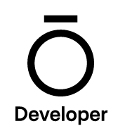

# HabitTrack

### Description
HabitTrack aims to make fitness trackers like Oura more useful by allowing users to experiment with habits and see if those habits are having a positive effect on their health metrics. Users can create habits and see how their activity, sleep and readiness scores are changing compared to their 3 month baseline scores.
<br/>
<br/>
**Where does the data come from?** <br/>
Currently only Oura ring integration is supported.
<br/>
<br/>
**Motivation** <br/>
Many people get wearable devices, but don’t actually make changes to improve their health. This app was created after I found trouble implementing and tracking my habits with my Oura ring.
<br/>
<br/>

Examples of potential habits include:
  - *Take 100mg of Magnesium Bisglycinate each night before bed.*
  - *Meditate every morning.*
  - *Go running every other day for 30 days.*

### Getting Started
 1. Create a Personal Access Token from the [Oura Cloud Dashboard](https://cloud.ouraring.com/personal-access-tokens).

 2. Fork the repo and rename `.env copy` to `.env` and add your PAT there. ⚠️ [Requires an Oura Ring] ⚠️

 3. ```cd client``` and ```npm run start``` to run the client then ```cd server``` and `nodemon .`
<br/>
<br/>

### The UI


### TechStack <br/>
Front end <br/>


Back end <br/>


Data<br/>
